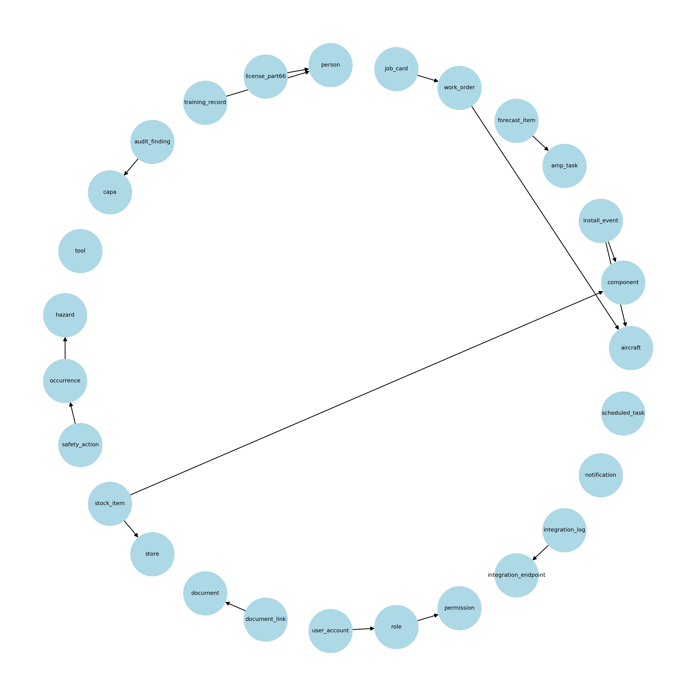
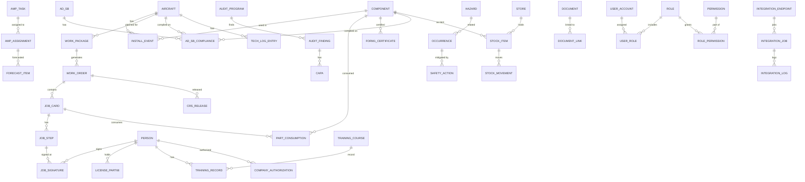

#  طراحی تخصصی داشبورد مدیریت ایمنی و نگهداری پیشگیرانه در هوانوردی

---

## 1. مقدمه و هدف پروژه  
هدف از این پروژه طراحی و پیاده‌سازی یک **سامانه مدیریت ایمنی (Safety Management System – SMS)** برای صنایع هوانوردی است که تمرکز آن بر **نگهداری و تعمیرات پیشگیرانه (Preventive Maintenance)** خواهد بود.  
این سامانه باید علاوه بر تطابق کامل با الزامات مقرراتی بین‌المللی (EASA، ICAO، و EU) بتواند داده‌های مرتبط با ناوگان، وظایف نگهداری، آموزش پرسنل، کیفیت و انطباق، رخدادهای ایمنی و شاخص‌های پایایی را مدیریت کرده و با یکپارچگی کامل به مدیران و تکنسین‌ها سرویس دهد.  

---

## 2. اسناد و مقررات مرجع (Regulatory Documents)  

### EASA Part-145  
مقرراتی برای سازمان‌های تعمیر و نگهداری هواپیما و قطعات. شامل الزامات ساختاری، صلاحیت پرسنل، ابزار و تجهیزات کالیبره، کنترل کیفیت، مدیریت سوابق و صدور **CRS** و **Form 1**.  
الهام‌بخش ماژول‌های: Work Execution، Inventory & Tooling، Quality & Compliance monitoring.  

### MOE (Maintenance Organization Exposition)  
سند داخلی هر سازمان Part-145 برای شرح چگونگی اجرای الزامات. شامل ساختار سازمانی، شرح وظایف، فرآیندهای نگهداری، سیاست‌های کیفیت و مدیریت سوابق.  
الهام‌بخش: لینک Findings به بندهای مرجع در Quality & Compliance monitoring.  

### MOM (Maintenance Organization Manual)  
دستورالعمل‌های داخلی سازمان، شامل گردش‌کار فرم‌ها، وظایف بخش‌ها، روش‌های داخلی.  
الهام‌بخش گردش‌کار Work Orders و Job Cards.  

### EASA Part-147  
مقررات مراکز آموزش تعمیر و نگهداری. شامل طراحی دوره‌ها، آزمون‌ها، صلاحیت مدرسان، سوابق آموزشی.  
الهام‌بخش: Training & Authorizations.  

### MMM / CAME  
سند مدیریت ادامه قابلیت پروازی. شامل AMP، AD/SB، Reliability Program، Tech Log، ARC.  
الهام‌بخش: AMP & Forecast، Reliability & KPIs، Tech Log.  

### Part-M / CAMO  
الزامات ادامه قابلیت پروازی ناوگان و CAMOها. شامل AMP، پیگیری AD/SB، LLP، تحلیل پایایی.  
الهام‌بخش: Fleet & Configuration، AMP & Forecast، Reliability.  

### EASA Part-66  
مجوز پرسنل تعمیر و نگهداری. دسته‌بندی B1/B2/C و الزامات آموزشی.  
الهام‌بخش: Training & Authorizations (کنترل اعتبار امضاها).  

### Part-21  
مقررات طراحی و تولید و تغییرات (STC). شامل TC، STC، Modifications.  
الهام‌بخش: Fleet & Configuration (ثبت تغییرات).  

### ICAO Annex 19 و EU 376/2014  
چارچوب SMS و گزارش رخدادها. شامل Hazard Identification، Risk Assessment، Occurrence Reporting.  
الهام‌بخش: Safety & Occurrence Reporting.  

### QMM (Quality Management monitoring Manual)  
سند مدیریت کیفیت داخلی سازمان. شامل سیاست‌های ممیزی، Findings، CAPA.  
الهام‌بخش: Quality & Compliance monitoring.  

### OEM Docs (AMM, CMM, IPC, SRM)  
مستندات سازنده هواپیما و قطعات. شامل دستورالعمل‌های گام‌به‌گام و حدود پذیرش.  
الهام‌بخش: Records & Tech Library.  

---

## 3. دهانه‌های داشبورد (Modules)  

### Fleet & Configuration  
- **کاربرد:** نمایش ناوگان، پیکربندی قطعات و وضعیت LLP.  
- **داده‌های نمایشی:** Tailها، قطعات نصب‌شده، عمر باقی‌مانده.  
- **ورودی‌ها:** ثبت هواپیمای جدید، نصب/برداشت قطعه.  
- **خروجی/نوتیفیکیشن:** هشدار پایان عمر LLP.  
- **جداول:** aircraft, component, install_event.  

### AMP & Forecast  
- **کاربرد:** مدیریت AMP و پیش‌بینی سررسید.  
- **داده‌های نمایشی:** تسک‌ها، تقویم، Gantt.  
- **ورودی‌ها:** تعریف تسک، تخصیص به ناوگان.  
- **خروجی/نوتیفیکیشن:** هشدار نزدیک سررسید.  
- **جداول:** amp_task, amp_assignment, forecast_item.  

### Work Execution  
- **کاربرد:** اجرای WO و Job Cards.  
- **داده‌های نمایشی:** WOهای باز/بسته، وضعیت کارت‌ها.  
- **ورودی‌ها:** ایجاد WO، تکمیل گام‌ها، مصرف قطعه.  
- **خروجی/نوتیفیکیشن:** CRS و Form 1.  
- **جداول:** work_order, job_card, job_step, job_signature, part_consumption.  

### Training & Authorizations  
- **کاربرد:** مدیریت آموزش‌ها و مجوزها.  
- **داده‌های نمایشی:** پروفایل پرسنل، لایسنس‌ها، دوره‌ها.  
- **ورودی‌ها:** ثبت دوره، تمدید مجوز.  
- **خروجی/نوتیفیکیشن:** هشدار انقضا.  
- **جداول:** person, license_part66, training_record, company_authorization.  

### Quality & Compliance  
- **کاربرد:** مدیریت ممیزی‌ها و Findings.  
- **داده‌های نمایشی:** برنامه ممیزی، CAPAها.  
- **ورودی‌ها:** ثبت Finding، تعریف CAPA.  
- **خروجی/نوتیفیکیشن:** هشدار Deadline.  
- **جداول:** audit_program, audit_finding, capa.  

### Safety & Occurrence Reporting  
- **کاربرد:** ثبت و تحلیل رخدادها.  
- **داده‌های نمایشی:** رخدادها، Risk Matrix، اقدامات ایمنی.  
- **ورودی‌ها:** ثبت Hazard/Occurrence.  
- **خروجی/نوتیفیکیشن:** هشدار رخداد پرخطر.  
- **جداول:** hazard, occurrence, safety_action, risk_matrix.  

### Records & Tech Library  
- **کاربرد:** آرشیو دیجیتال اسناد.  
- **داده‌های نمایشی:** Tech Log، Dash Forms، AMM/CMM.  
- **ورودی‌ها:** بارگذاری سند.  
- **خروجی/نوتیفیکیشن:** هشدار سند منسوخ.  
- **جداول:** document, document_link, tech_log_entry.  

### Inventory & Tooling  
- **کاربرد:** مدیریت قطعات و ابزار.  
- **داده‌های نمایشی:** وضعیت انبار، Shelf-Life، کالیبراسیون.  
- **ورودی‌ها:** ورود/خروج قطعه.  
- **خروجی/نوتیفیکیشن:** هشدار انقضا/کالیبراسیون.  
- **جداول:** store, stock_item, tool.  

### Reliability & KPIs  
- **کاربرد:** شاخص‌های آماری ناوگان.  
- **داده‌های نمایشی:** MTBF، MTTR، On-Time %.  
- **ورودی‌ها:** انتخاب بازه/ناوگان.  
- **خروجی:** هشدار مدیریتی.  
- **جداول:** kpi_snapshot (views).  

### Admin & Master Data  
- **کاربرد:** مدیریت کاربران و داده‌های پایه.  
- **داده‌های نمایشی:** کاربران، نقش‌ها، Capability List.  
- **ورودی‌ها:** ایجاد کاربر، اختصاص نقش.  
- **جداول:** user_account, role, permission, capability.  

### Integrations  
- **کاربرد:** اتصال به سیستم‌های خارجی.  
- **داده‌های نمایشی:** وضعیت Sync.  
- **ورودی‌ها:** تعریف Endpoint.  
- **خروجی/نوتیفیکیشن:** هشدار شکست Sync.  
- **جداول:** integration_endpoint, integration_job, integration_log.  

### Form 1 Management (جدید)
- **کاربرد:** مدیریت، صدور، ردیابی و اعتبارسنجی **EASA Form 1** برای قطعات/تجهیزات.
- **داده‌های نمایشی:** لیست Form 1 با فیلتر Part/Serial/Issuer/Status، Trace به Component→WO→Aircraft، KPI صحت اسناد.
- **ورودی‌ها:** ایجاد/ویرایش Form 1 (Certificate No, Part/Serial, Issued Date, Issuing Org, Attachments)، تغییر وضعیت (Revoked/Expired).
- **خروجی/نوتیفیکیشن:** Blocker هنگام نصب قطعه بدون Form 1 معتبر؛ هشدار مدیریتی Form 1های منقضی/ناقص.
- **جداول:** `form1_certificate`, `component`, `install_event`, `work_order`, `aircraft`, `document`.

### Form 4 Management (جدید)
- **کاربرد:** مدیریت پست‌های کلیدی و **Form 4** (Post Holders) برای سازمان‌های Part-145/147.
- **داده‌های نمایشی:** لیست Form 4 (Person, Position, OrgType, Status, Dates)، نما ساختار سازمانی، شاخص پوشش پست‌ها.
- **ورودی‌ها:** ثبت/ویرایش Form 4 (Person, Position, Submitted/Approved Dates, Attachments)، بروزرسانی وضعیت مرجع.
- **خروجی/نوتیفیکیشن:** هشدار جایگاه‌های خالی یا نزدیک انقضا؛ اخطار رد درخواست توسط مرجع.
- **جداول:** `form4_declaration`, `person`, `organization`(145/147), `document`, `user_account`.

---

## 4. معماری داده (Data Architecture)  

### ERD سطح کلان (Mermaid)  

---

### توضیح روابط (چرا یال‌ها وجود دارند و در کجا کاربرد دارند)  
- **INSTALL_EVENT → AIRCRAFT/COMPONENT**: تاریخچه نصب/برداشت قطعه؛ در «Fleet & Configuration».  
- **AMP_TASK → AMP_ASSIGNMENT → FORECAST_ITEM**: تعریف و تخصیص AMP؛ در «AMP & Forecast».  
- **WORK_PACKAGE → WORK_ORDER → JOB_CARD → JOB_STEP**: زنجیره اجرای کار؛ در «Work Execution».  
- **JOB_SIGNATURE (→ JOB_STEP, PERSON)**: امضای کار/بازرسی؛ در «Work Execution» و «Training & Authorizations».  
- **PART_CONSUMPTION (→ JOB_CARD, COMPONENT)**: مصرف قطعه؛ در «Inventory & Tooling».  
- **CRS_RELEASE → WORK_ORDER**: صدور CRS؛ در «Work Execution».  
- **FORM1_CERTIFICATE → COMPONENT**: مدرک قانونی قطعه؛ در «Records».  
- **AD_SB → AD_SB_COMPLIANCE → AIRCRAFT/COMPONENT**: انطباق AD/SB؛ در «Fleet» و «Quality».  
- **PERSON → LICENSE_PART66/TRAINING_RECORD/COMPANY_AUTHORIZATION**: صلاحیت‌ها؛ در «Training & Authorizations».  
- **AUDIT_PROGRAM → AUDIT_FINDING → CAPA**: چرخه ممیزی؛ در «Quality & Compliance monitoring».  
- **HAZARD → OCCURRENCE → SAFETY_ACTION**: SMS؛ در «Safety & Occurrence Reporting».  
- **STORE → STOCK_ITEM → STOCK_MOVEMENT**: مدیریت انبار؛ در «Inventory & Tooling».  
- **DOCUMENT → DOCUMENT_LINK / TECH_LOG_ENTRY → AIRCRAFT**: اسناد و لاگ‌ها؛ در «Records & Tech Library».  
- **RBAC (USER_ACCOUNT/ROLE/PERMISSION)**: کنترل دسترسی؛ در «Admin & Master Data».  
- **INTEGRATION_ENDPOINT → INTEGRATION_JOB → INTEGRATION_LOG**: همگام‌سازی؛ در «Integrations».  
- **NOTIFICATION / SCHEDULED_TASK**: اعلان‌ها و زمان‌بندی؛ همه ماژول‌ها.  

---

## 5. امکان‌سنجی فنی (Feasibility Check)  

### Backend (PostgreSQL)  
- Database: PostgreSQL 15+ (مطابق سیاست کارفرما).  
- Extensions: `pgcrypto`, `uuid-ossp`, `pg_trgm`, `btree_gin`.  
- Materialized Views برای KPI و Forecast.  
- Celery/Temporal برای زمان‌بندی وظایف.  
- RLS برای امنیت داده‌ها.  
- Object Storage (S3/MinIO) برای مدارک.  
- Audit Trail با تریگرها.  

### Frontend (React)  
- Framework: React + TypeScript.  
- State Management: Redux Toolkit Query / React Query.  
- Components: Data Tables, Gantt, Calendar, Charts.  
- Notifications: Toast برای اطلاع، Modal برای هشدار/بلاک.  
- Role-based Access Control.  

---

## 6. نوتیفیکیشن‌ها و پاپ‌آپ‌ها  
- Fleet & Config → هشدار پایان عمر LLP (Modal).  
- AMP & Forecast → هشدار سررسید نزدیک (Toast + Email).  
- Work Execution → بلاک امضا بدون مجوز (Blocker Modal).  
- Training & Auth → هشدار انقضای مجوز (Modal).  
- Quality & Compliance monitoring → هشدار CAPA نزدیک به Deadline (Toast).  
- Safety & Occurrence → هشدار رخداد با ریسک بالا (Blocker Modal).  
- Inventory → هشدار Shelf-life/Calibration (Toast).  

---

## 7. گردش‌کارهای کلیدی (Workflows)  
- AMP → Forecast → Work Package → WO → Job Card → CRS/Form 1.  
- AD/SB → Applicability → Compliance Record.  
- Occurrence → Risk Assessment → Safety Action → CAPA.  
- Training → Authorization → Signature Validation.  

---

## 8. KPIها و گزارش‌ها  
- MTBF, MTTR.  
- On-Time Maintenance %.  
- Unscheduled Maintenance Rate.  
- AD/SB Compliance %.  
- Training Currency %.  
- Calibration On-Time %.  
- CAPA Closure Rate.  
- Safety Indicators (High-Risk Occurrences, Actions Closed on Time).  

---

## 9. ماتریس ردیابی (Traceability Matrix)  
- Work Execution → Part-145 (CRS/Form 1).  
- Training & Auth → Part-66, Part-147.  
- Quality & Compliance monitoring → QMM, Part-145, MOE.  
- SMS & Occurrence → Annex 19, EU 376/2014.  
- AMP & Forecast → CAME/MMM, Part-M.  
- Fleet & Config → Part-21, Part-M.  
- Records & Tech Library → OEM Docs.  

---

## واژه‌نامه تخصصی (Glossary)  
- سامانه مدیریت ایمنی → Safety Management System (SMS)  
- نگهداری پیشگیرانه → Preventive Maintenance  
- برنامه تعمیر و نگهداری تأییدشده → Approved Maintenance Program (AMP)  
- گواهی صلاحیت بازگشت به سرویس → Certificate of Release to Service (CRS)  
- قطعات عمرمحدود → Life-Limited Parts (LLP)  
- مدرک Form 1 → EASA Form 1  
- گواهی قابلیت پروازی → Airworthiness Review Certificate (ARC)  
- گواهی نوع → Type Certificate (TC)  
- گواهی تغییر → Supplemental Type Certificate (STC)  
- رخداد ایمنی → Occurrence  
- اقدام اصلاحی و پیشگیرانه → Corrective and Preventive Action (CAPA)  
- یافته ممیزی → Audit Finding  
- برنامه پایایی → Reliability Program  
- دفتر لاگ فنی → Technical Log (Tech Log)  
- ماژول → Module  
- بسته کاری → Work Package  
- دستور کار → Work Order (WO)  
- کارت کار → Job Card  
- امضای دیجیتال → Digital Signature  
- مجوز Part-66 → EASA Part-66 License  
- مرکز آموزش Part-147 → EASA Part-147 Training Organization  
